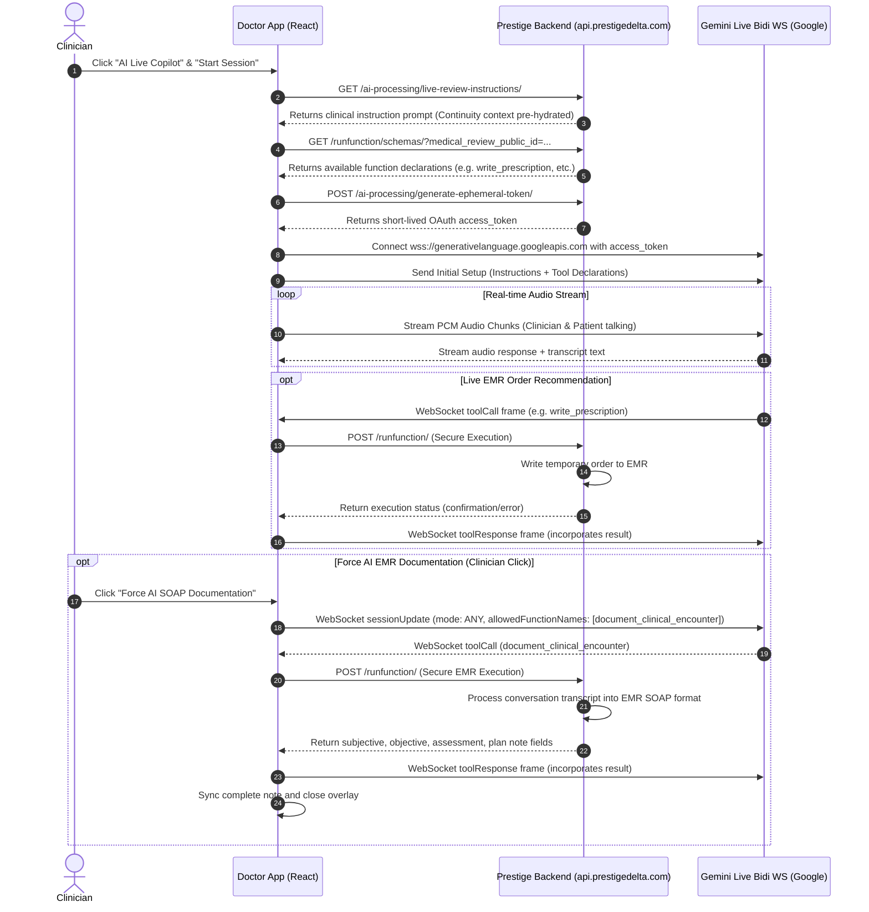

# Specification: End-to-End Gemini Live Function Calling & EMR Integration

This document outlines the backend API specifications required to support real-time audio triage, Ranked Differential Diagnoses, and EMR tool execution in the Doctor App (`prestige-doctor`) using **Google Gemini Live (Bidirectional WebSockets)**.

---

## 🔄 Architectural Overview

The AI Live Copilot communicates with two layers:
1. **Prestige Delta Backend (`https://api.prestigedelta.com`)**: Provides system instructions, dynamically declares available tools (function schemas), authenticates sessions, and executes local EMR tool operations.
2. **Google Gemini Live API (`wss://generativelanguage.googleapis.com`)**: Handles real-time PCM audio streaming, provides scrolling transcripts, calculates diagnostic probabilities, and initiates tool dispatch frames.



---

## 🌐 Endpoint 1a: Pre-Hydrated Patient Instructions Fetch

Fetches the customized, patient-specific prompt instruction for the copilot session. This prompt includes pre-hydrated patient EMR summaries, chief complaints, age, and historical continuity context.

* **Endpoint:** `GET /ai-processing/live-review-instructions/`
* **Query Parameters:**
  * `medical_review_public_id` (string, UUID): The target patient review instance.
* **Headers:**
  * `Authorization: Bearer <JWT_Token>`
* **Success Response (200 OK):**
```json
{
  "instructions": "You are Antigravity Copilot, an elite AI clinical assistant. Your current patient is John Doe, a 45-year-old male with a chief complaint of sudden localized abdominal pain. Historical continuity reveals prior minor dyspepsia. Provide live differential diagnoses, probing checklist guidance, and appropriate clinical orders."
}
```

---

## 📝 Endpoint 1b: Custom User-Created Instructions Templates (Template Creator)

Doctors want to be able to create, save, manage, and fetch their own system instructions or clinical guidelines.

### 1. Fetch Custom Instructions
* **Endpoint:** `GET /ai-processing/custom-instructions/`
* **Headers:**
  * `Authorization: Bearer <JWT_Token>`
* **Success Response (200 OK):**
```json
[
  {
    "id": 1,
    "title": "Pediatric Ward Round Template",
    "instructions": "You are Antigravity Pediatric Copilot. Emphasize developmental milestones, hydration checks, child weight-dose calculations, and friendly bedside tone.",
    "is_active": true
  },
  {
    "id": 2,
    "title": "Geriatric Complex Triage Template",
    "instructions": "You are Antigravity Geriatric Copilot. Emphasize polypharmacy avoidance, cognitive baselines, mobility assessment, and subtle symptom progressions.",
    "is_active": false
  }
]
```

### 2. Create Custom Instructions
* **Endpoint:** `POST /ai-processing/custom-instructions/`
* **Headers:**
  * `Authorization: Bearer <JWT_Token>`
  * `Content-Type: application/json`
* **Request Body:**
```json
{
  "title": "Cardiology Consultation Template",
  "instructions": "You are Antigravity Cardiology Copilot. Emphasize chest pain migration, ECG intervals, lipid control profiles, and hourly vitals.",
  "is_active": true
}
```
* **Success Response (201 Created):**
```json
{
  "id": 3,
  "title": "Cardiology Consultation Template",
  "instructions": "You are Antigravity Cardiology Copilot. Emphasize chest pain migration, ECG intervals, lipid control profiles, and hourly vitals.",
  "is_active": true,
  "created_at": "2026-06-02T01:36:12Z"
}
```

---

## 🧠 Endpoint 2: Function Schemas & Tool Declarations

Provides the array of tool declarations (function models) that the Gemini model is permitted to execute during the live session.

* **Endpoint:** `GET /runfunction/schemas/`
* **Query Parameters:**
  * `medical_review_public_id` (string, UUID)
  * `mode` (string): e.g., `"live_consultation"`
* **Headers:**
  * `Authorization: Bearer <JWT_Token>`
* **Success Response (200 OK):**
```json
{
  "functions": [
    {
      "name": "propose_prescription",
      "description": "Proposes a medication order for this patient based on active diagnostic results.",
      "parameters": {
        "type": "OBJECT",
        "properties": {
          "medication_name": { "type": "STRING", "description": "Generic or brand name of the drug." },
          "dosage": { "type": "STRING", "description": "Quantity per dose (e.g. 500mg, 1g)." },
          "route": { "type": "STRING", "description": "Administration route.", "enum": ["oral", "intravenous", "intramuscular", "subcutaneous"] },
          "interval": { "type": "INTEGER", "description": "Dosing frequency in hours (e.g. 8 for Q8h)." },
          "instructions": { "type": "STRING", "description": "Specific directions (e.g., take with food)." }
        },
        "required": ["medication_name", "dosage", "interval"]
      }
    },
    {
      "name": "propose_investigation",
      "description": "Suggests diagnostic lab or imaging tests.",
      "parameters": {
        "type": "OBJECT",
        "properties": {
          "test_type": { "type": "STRING", "description": "Name of investigation (e.g. Abdominal Ultrasound, CBC)." },
          "reason": { "type": "STRING", "description": "Clinical justification." },
          "instructions": { "type": "STRING", "description": "Preparation rules (e.g. fasting, full bladder)." }
        },
        "required": ["test_type", "reason"]
      }
    },
    {
      "name": "propose_clinical_action",
      "description": "Proposes counselling topics, procedures, or specialist referrals.",
      "parameters": {
        "type": "OBJECT",
        "properties": {
          "action_type": { "type": "STRING", "enum": ["counselling", "procedure", "referral"] },
          "name": { "type": "STRING", "description": "Action details (e.g. Strict NPO, General Surgery Review)." },
          "notes": { "type": "STRING", "description": "Clinical guidelines or scheduling directives." }
        },
        "required": ["action_type", "name"]
      }
    },
    {
      "name": "document_clinical_encounter",
      "description": "Processes the dialogue and writes a SOAP encounter note. (Alternative alias: document_medical_review). Triggered forcedly via sessionUpdate configurations.",
      "parameters": {
        "type": "OBJECT",
        "properties": {
          "transcript": { "type": "STRING", "description": "Active conversational transcript generated so far." }
        },
        "required": ["transcript"]
      }
    }
  ],
  "builtin_tools": []
}
```

---

## 🔑 Endpoint 3: Ephemeral Access Token Generator

Generates a temporary, short-lived Google OAuth token scoped solely for starting a `GenerativeService` WebSocket connection.

* **Endpoint:** `POST /ai-processing/generate-ephemeral-token/`
* **Headers:**
  * `Authorization: Bearer <JWT_Token>`
  * `Content-Type: application/json`
* **Success Response (200 OK):**
```json
{
  "token": "ya29.c.Co0BCwEBAg...[truncated ephemeral oauth token]...",
  "expires_in": 3600,
  "model": "gemini-3.1-flash-live-preview",
  "session_id": "session_uuid_12345"
}
```

---

## ⚡ Endpoint 4: Tool Call Execution Router

Receives tool requests dispatched by Gemini Live, executes the corresponding EMR database mutations securely, and returns formatted confirmation payloads.

* **Endpoint:** `POST /runfunction/`
* **Headers:**
  * `Authorization: Bearer <JWT_Token>`
  * `Content-Type: application/json`
* **Request Body (Medication Propose Example):**
```json
{
  "call_id": "call_abcd1234",
  "function_name": "propose_prescription",
  "arguments": {
    "medication_name": "Paracetamol IV",
    "dosage": "1g",
    "route": "intravenous",
    "interval": 8,
    "instructions": "Administer slowly over 15 minutes."
  }
}
```
* **Success Response (200 OK):**
```json
{
  "call_id": "call_abcd1234",
  "result": {
    "status": "success",
    "order_id": "ord_98765",
    "message": "Medication Paracetamol IV 1g IV ordered. EMR sync pending clinician confirmation."
  }
}
```

---

## 🪄 Dynamic Forced Tool Calling Spec (WebSocket sessionUpdate)

During a live audio session, the client can force the Gemini model to call a particular tool in a turn. This is executed by sending a `sessionUpdate` frame over the WebSocket.

### 1. Mid-Session Configuration Update (Frontend -> Gemini Live WebSocket):
To force a tool call (e.g. `document_clinical_encounter`), the client updates the `toolConfig.functionCallingConfig`:
```json
{
  "sessionUpdate": {
    "toolConfig": {
      "functionCallingConfig": {
        "mode": "ANY",
        "allowedFunctionNames": ["document_clinical_encounter"]
      }
    }
  }
}
```

### 2. Turn Prompt Request (Frontend -> Gemini Live WebSocket):
After updating the configuration, the client prompts the model to trigger the response turn:
```json
{
  "clientContent": {
    "turns": [
      {
        "role": "user",
        "parts": [{ "text": "Please generate the clinical SOAP documentation for our discussion immediately." }]
      }
    ],
    "turnComplete": true
  }
}
```

### 3. Server-Initiated Forced Function Call (Gemini -> Frontend):
Because the calling mode is set to `"ANY"`, the model responds by executing the allowed function:
```json
{
  "toolCall": {
    "functionCalls": [
      {
        "name": "document_clinical_encounter",
        "id": "call_forced_doc_12345",
        "args": {
          "transcript": "PATIENT: Doctor, I've had this really bad abdominal pain...\nCLINICIAN: Did it migrate?"
        }
      }
    ]
  }
}
```

### 4. Tool Execution Response (Frontend -> Gemini):
The client captures the toolCall, executes it via `POST /runfunction/` (supporting `document_clinical_encounter` as a clean alias routing directly to the backend `document_medical_review` handler), and sends back the result:
```json
{
  "toolResponse": {
    "functionResponses": [
      {
        "response": {
          "output": {
            "status": "success",
            "message": "EMR documentation generated successfully."
          }
        },
        "id": "call_forced_doc_12345"
      }
    ]
  }
}
```
*(Note: Because the `/runfunction/` execution endpoint remains completely unmodified and fully backward-compatible, integrations from the patient app or other devices are completely safe and unaffected!)*
