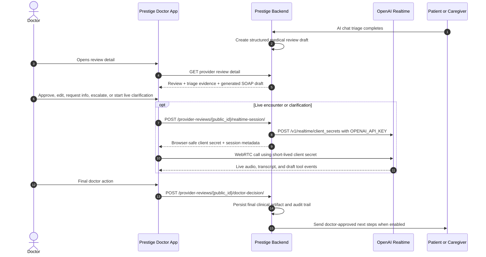

# Specification: OpenAI Realtime Clinical Copilot and AI Triage Loop

This is the active backend contract for live encounter assistance and AI triage review approval. Gemini Live is legacy only; the primary realtime provider is OpenAI Realtime with `gpt-realtime-mini`.

## Provider Decision

- Primary realtime model: `gpt-realtime-mini`.
- Browser never receives the standard OpenAI API key.
- Backend reads `OPENAI_API_KEY` from its `.env`.
- Backend returns short-lived OpenAI Realtime client secrets for browser WebRTC.
- Doctor approval remains mandatory for final documentation, prescriptions, investigations, referrals, patient instructions, and escalation.

## End-to-End Flow



## Realtime Session Endpoint

```http
POST /provider-reviews/{public_id}/realtime-session/
```

Request:

```json
{
  "model": "gpt-realtime-mini",
  "mode": "live_encounter",
  "review_origin": "ai_triage",
  "patient_id": 123,
  "patient_name": "Jane Doe",
  "chief_complaint": "Abdominal pain",
  "continuity_brief": "Prior history and recent review context",
  "triage_context": {
    "urgency": { "value": "urgent", "label": "Urgent" },
    "generated_note": {},
    "patient_story": "Patient/caregiver triage summary and relevant transcript excerpts.",
    "missing_information": [
      {
        "question": "Does the pain worsen with exertion?",
        "reason": "Clarify red-flag pattern before approval"
      }
    ],
    "risk_flags": [
      {
        "label": "Possible cardiac red flag",
        "severity": "urgent",
        "evidence": "Patient reported chest discomfort and sweating"
      }
    ],
    "evidence_anchors": [
      {
        "section": "subjective",
        "field": "history_of_present_illness",
        "source_type": "patient_reported",
        "verification_status": "unverified",
        "quote": "Chest discomfort started yesterday evening"
      }
    ],
    "approval_readiness": {
      "can_approve": false,
      "blockers": [
        {
          "id": "emergency_risk",
          "label": "Escalate unresolved emergency risk before approval.",
          "severity": "error"
        }
      ],
      "warnings": []
    },
    "clarification_focus": {
      "focus_items": [
        "Safety: Possible cardiac red flag",
        "Ask: Does the pain worsen with exertion?",
        "Approval blocker: Escalate unresolved emergency risk before approval."
      ],
      "avoid_repeating_completed_intake": true,
      "stop_when_approval_blockers_are_resolved": true
    },
    "safety_boundaries": {
      "draft_only": true,
      "doctor_approval_required": true,
      "no_autonomous_prescribing": true,
      "no_autonomous_finalization": true,
      "preserve_source_labels": true
    }
  },
  "capability_expectations": {
    "draft_only": true,
    "doctor_approval_required": true,
    "patient_follow_through_after_approval": true,
    "preserve_source_labels": true
  }
}
```

Backend behavior:

- Authenticate and authorize the doctor for the review.
- Build clinical instructions from review detail, triage evidence, prior context, and hospital policy.
- In `triage_clarification` mode, instruct the model to focus on `triage_context.clarification_focus.focus_items`, avoid repeating completed intake, preserve source labels, and stop once approval blockers are resolved enough for doctor review.
- Create an OpenAI Realtime client secret using the backend `OPENAI_API_KEY` via `/v1/realtime/client_secrets`.
- Set the session model to `gpt-realtime-mini`.
- Use a short expiry suitable for browser handoff.
- Persist an `openai_realtime_session` audit event without storing the ephemeral secret in metadata.
- Return only browser-safe connection details.
- Return a `capability_contract` describing the realtime assistant jobs, guardrails, event shape, and doctor-approval boundaries.
- Include `review_context.safety_gate` so the frontend can show whether realtime support is operating under unresolved safety pressure.

Preferred response:

```json
{
  "session_id": "rt_123",
  "connection_mode": "browser_webrtc",
  "model": "gpt-realtime-mini",
  "client_secret": {
    "value": "ek_short_lived_client_secret",
    "expires_at": 1780833600
  },
  "value": "ek_short_lived_client_secret",
  "expires_at": 1780833600,
  "instructions": "You are Prestige Health's doctor-facing clinical copilot...",
  "capability_contract": {
    "version": "prestige_realtime_clinical_copilot_v1",
    "primary_jobs": [
      "capture_encounter_documentation",
      "surface_missing_subjective_and_objective_data",
      "suggest_focused_doctor_questions",
      "maintain_differential_reasoning_with_evidence",
      "flag_emergency_or_critical_safety_risks",
      "draft_patient_friendly_next_steps_after_doctor_approval",
      "prepare_follow_through_tasks_for_patient_or_caregiver"
    ],
    "decision_rights": {
      "doctor_remains_final_authority": true
    }
  },
  "review_context": {
    "review_public_id": "review_public_id",
    "safety_gate": {
      "blocked": false,
      "requires_escalation": false,
      "escalation_recorded": false,
      "emergency_flags": []
    }
  },
  "client_session_config": {
    "type": "realtime",
    "model": "gpt-realtime-mini"
  }
}
```

The frontend already accepts `client_secret.value`, `client_secret` as a string, `session.client_secret.value`, and a few legacy aliases. Prefer the object shape above.

Realtime assistant scope:

- Capture encounter documentation continuously.
- Identify missing subjective/objective data.
- Suggest doctor-ready focused questions.
- Maintain differential reasoning with evidence anchors.
- Flag emergency/critical risks early.
- Draft candidate medications, investigations, referrals, patient education, and follow-through tasks.
- Never finalize diagnoses, prescriptions, orders, referrals, discharge instructions, patient messages, or review approval without an explicit doctor UI action and backend permission check.

Structured copilot update events:

The doctor frontend now listens for Realtime events that either directly contain this object or contain it as JSON text in a Realtime response payload:

```json
{
  "type": "prestige.copilot.update",
  "running_summary": [
    "Pain began yesterday and migrated to the right lower quadrant."
  ],
  "missing_information": [
    "Medication allergies",
    "Last oral intake"
  ],
  "risk_flags": [
    {
      "label": "Possible surgical abdomen",
      "severity": "urgent",
      "evidence": "Fever, migration, pain with movement"
    }
  ],
  "suggested_questions": [
    {
      "question": "When was the last time you ate or drank?",
      "rationale": "Pre-operative fasting readiness"
    }
  ],
  "draft_assessment": {
    "differentials": [
      {
        "name": "Acute appendicitis",
        "probability": 0.82,
        "logic": "Migratory RLQ pain with fever and movement sensitivity"
      }
    ]
  },
  "candidate_actions": {
    "investigations": [
      {
        "test_type": "CBC with differential",
        "reason": "Assess leukocytosis"
      }
    ],
    "referrals": [
      {
        "name": "Urgent general surgery consult",
        "reason": "Assess possible surgical emergency"
      }
    ]
  },
  "patient_follow_through_tasks": [
    "Return immediately for worsening pain, fainting, persistent vomiting, or fever."
  ]
}
```

The UI applies these updates to the OpenAI Realtime Brief, ranked differentials, probing questions, draft action trays, and patient follow-through chips. Doctor-selected drafts and already-asked questions remain selected when later copilot updates merge into the same item.

## Draft Action Sync Contract

When the doctor clicks `Sync Drafts to Review`, the frontend merges selected realtime copilot medications, investigations, referrals, procedures, and counselling actions into the doctor note as drafts only.

Every synced item must carry:

```json
{
  "source": "openai_realtime_copilot",
  "source_mode": "live_encounter",
  "review_origin": "ai_triage",
  "clinical_action_kind": "prescription",
  "approval_status": "draft_pending_doctor_approval",
  "requires_doctor_approval": true,
  "draft_only": true,
  "copilot_generated": true
}
```

Backend save/finalize behavior:

- Treat these items as doctor-note drafts, not placed orders.
- Preserve the metadata through `save-note`.
- Convert drafts into official orders, prescriptions, referrals, patient instructions, or follow-through tasks only after explicit doctor approval changes the item to `approval_status = doctor_approved`.
- Reject any realtime-origin item that attempts to arrive as already approved, patient-facing, dispensed, ordered, sent, or finalized without a doctor approval event.

Doctor approval event shape:

```json
{
  "approval_status": "doctor_approved",
  "requires_doctor_approval": false,
  "draft_only": false,
  "doctor_approved": true,
  "approved_by_doctor": true,
  "approved_at": "2026-06-08T10:00:00.000Z",
  "approved_by": "doctor_id_or_review_surface"
}
```

Frontend guardrail:

- The review detail page blocks AI-triage approval and finalization while any realtime-origin clinical action is still `draft_pending_doctor_approval`.
- The doctor note exposes an `Approve Drafts` action that marks pending realtime prescriptions, investigations, and other clinical actions as doctor-approved in the editable note.
- Patient follow-through filters pending realtime drafts out of WhatsApp/patient-app/chat tasks and disables sending until all such drafts are approved or removed.
- Patient-facing follow-through payloads include `excluded_realtime_draft_action_count` and `pending_realtime_draft_actions` for backend auditability.

## Doctor Decision Endpoint

```http
POST /provider-reviews/{public_id}/doctor-decision/
```

Decisions:

- `approve_as_is`
- `edit_and_approve`
- `request_more_info`
- `convert_to_live_encounter`
- `escalate`
- `reject`

Persist:

- Doctor id and organization.
- Decision.
- Final or draft note payload.
- AI triage origin and urgency.
- Clinical training feedback when present.
- Patient communication flags.
- Audit metadata.

Safety behavior:

- `approve_as_is` and `edit_and_approve` are blocked with `409 emergency_risk_unresolved` when the review contains unresolved emergency/critical safety flags and no doctor escalation has been recorded.
- `escalate` creates the audit event that releases the gate once the doctor has acknowledged the emergency path.
- Provider review detail includes `safety_gate` with `blocked`, `requires_escalation`, `escalation_recorded`, and `emergency_flags`.

## Patient More-Info Endpoint

```http
POST /provider-reviews/{public_id}/request-more-info/
```

Request:

```json
{
  "questions": [
    {
      "question": "Please share your current temperature and when it was measured.",
      "reason": "Confirm fever severity before approval"
    }
  ],
  "delivery_channel": "chat"
}
```

Backend behavior:

- Send questions to patient or caregiver in the patient app/chat channel.
- Mark review `needs_patient_info`.
- Resume the review when answers arrive.
- Persist full audit trail.

## Patient Follow-through Endpoint

```http
POST /provider-reviews/{public_id}/patient-follow-through/
```

This endpoint closes the loop after doctor review. It turns the approved review into patient-facing next steps and trackable tasks.

Request:

```json
{
  "patient": {
    "first_name": "Jane",
    "last_name": "Doe",
    "phone": "+2348012345678",
    "email": "jane@example.com"
  },
  "patient_summary": "Doctor-approved explanation and next steps",
  "tasks": [
    {
      "type": "medication",
      "title": "Paracetamol",
      "detail": "500mg by mouth every 8 hours as needed",
      "status": "pending",
      "source_id": 123
    },
    {
      "type": "investigation",
      "title": "CBC",
      "detail": "Check for infection markers",
      "status": "pending",
      "source_id": 456
    },
    {
      "type": "follow_up",
      "title": "Follow-up review",
      "detail": "Recommended for Jun 10, 2026, 09:00 AM",
      "status": "pending",
      "source_id": null
    }
  ],
  "recipient": {
    "role": "authorized_caregiver",
    "caregiver_name": "Ada Okafor",
    "caregiver_relationship": "daughter",
    "patient_present": true,
    "patient_identity_confirmed": true,
    "authorization_status": "authorized"
  },
  "delivery_channels": ["whatsapp", "patient_app", "chat"],
  "completion_tracking": {
    "enabled": true,
    "allowed_channels": ["whatsapp_ai_agent", "patient_app", "chat"],
    "patient_or_caregiver_can_confirm_items": true
  },
  "require_doctor_approval": true,
  "metadata": {
    "surface": "doctor_review_detail",
    "review_public_id": "review_public_id",
    "completion_loop": "whatsapp_ai_agent",
    "caregiver_context": {
      "is_caregiver_submitted": true,
      "caregiver_name": "Ada Okafor",
      "caregiver_relationship": "daughter",
      "patient_present": true,
      "patient_identity_confirmed": true,
      "authorized_recipient": true
    }
  }
}
```

Backend behavior:

- Verify doctor access to the review.
- Reject if the review is not doctor-approved/finalized.
- Reject with `409 emergency_risk_unresolved` when unresolved emergency/critical safety flags are present and no doctor escalation has been recorded.
- Persist patient-facing summary and tasks as native `TaskChecklistItem` rows on the patient workflow task.
- Deliver the summary/tasks through WhatsApp, patient app, and chat channels when available.
- Let the WhatsApp AI agent call the native checklist completion flow when a patient or authorized caregiver says a task is done.
- For caregiver-submitted reviews, verify relationship, patient identity confidence, patient presence when available, and recipient authorization before sending patient-facing instructions to a caregiver.
- Persist the sent plan and checklist-linked task preview in `TaskEvent` metadata for queue/detail display.
- Return updated follow-through state in provider review detail and queue summaries.
- Return `attention_status`, `attention_reasons`, or equivalent fields when tasks are overdue, missed, failed, or stalled without patient/caregiver completion.
- Use `agent_follow_up.completion_command` or `completion_tracking.agent_completion_command` as the active WhatsApp AI command contract. It includes the native checklist endpoint, payload template, blockers, and `should_promote_next_task_after_completion`.
- Classify the patient/caregiver reply before calling the command: completion confirmations record `completed = true`; access barriers or "not done" replies record `completed = false` with `completion_intent = unable_to_complete`; safety deterioration replies set `completion_intent = safety_escalation` and must create/escalate a provider task instead of marking the checklist item complete.
- Persist an audit event so `DoctorWorkflowAuditTrail` can show that the plan was sent.

Preferred response:

```json
{
  "status": "sent",
  "sent_at": "2026-06-07T16:30:00Z",
  "delivery_channels": ["whatsapp", "patient_app", "chat"],
  "completion_tracking": {
    "enabled": true,
    "allowed_channels": ["whatsapp_ai_agent", "patient_app", "chat"]
  },
  "total_tasks": 3,
  "completed_tasks": 0,
  "remaining_tasks": 3,
  "attention_status": "active",
  "attention_reasons": [],
  "tasks": [
    {
      "id": "follow-through-1",
      "type": "medication",
      "title": "Paracetamol",
      "detail": "500mg by mouth every 8 hours as needed",
      "status": "pending",
      "checklist_item_id": 501,
      "workflow_state": "ready",
      "is_next_in_line": true,
      "is_completed": false,
      "responsible_party_role": "patient"
    }
  ],
  "message": "Patient follow-through plan sent."
}
```

## Patient/Caregiver Task Completion Endpoint

```http
POST /task-threads/{task_public_id}/checklist-items/{checklist_item_id}/completion/
```

This endpoint is the patient-side close-the-loop path. It lets the patient, an assigned caregiver, an assigned user, an authorized provider, or the WhatsApp AI agent acting on a patient/caregiver confirmation mark doctor-approved follow-through tasks complete or incomplete.

Request:

```json
{
  "completed": true,
  "note": "I took the medication and sent my symptom update.",
  "record_compliance": true
}
```

Backend behavior:

- Verify the actor can update this task as the patient, assigned responsible user, caregiver/biller/family participant, responsible provider, or staff.
- Call the native checklist completion flow so medication compliance and next-item promotion continue to work.
- Persist checklist progress on the task metadata.
- Mark the task objective complete when every checklist item is done.
- Create a `TaskEvent` linked to the original medical review when available.
- Return updated task, checklist item, and progress state.

Preferred response:

```json
{
  "success": true,
  "item": {
    "id": 501,
    "status": "completed",
    "is_completed": true,
    "completed_at": "2026-06-07T17:10:00Z",
    "workflow_state": "completed"
  },
  "progress": {
    "total_items": 3,
    "completed_items": 1,
    "remaining_items": 2,
    "next_item_id": 502
  },
  "event_id": 9001
}
```

Patient app magic-link route:

```http
POST /engagement-dashboard/tasks/checklist-completion/?token={dashboard_token}&patient_id={patient_id}
```

This is the patient/caregiver dashboard path used by `prestige-sub`. It accepts `task_public_id`, `checklist_item_id`, `completed`, `note`, and `record_compliance`, then applies the same native checklist completion flow and emits the same medical-review-linked audit event.

## Tool Safety

Realtime tools may draft:

- SOAP note changes.
- Follow-up questions.
- Differential reasoning.
- Patient education.
- Prescriptions, investigations, referrals, and procedures.

Realtime tools must not directly finalize:

- Prescriptions.
- Investigations.
- Referrals.
- Patient instructions.
- Medical review finalization.

Privileged actions require a doctor UI action and backend permission check.

## Enterprise Reporting State

Provider review queue responses should eventually include authoritative reporting fields so the frontend command center can move from client-computed estimates to backend-certified metrics.

Recommended queue/detail fields:

- `review_origin`
- `urgency_level`
- `risk_flags`
- `missing_information`
- `patient_follow_through_status`
- `patient_follow_through.sent_at`
- `patient_follow_through.tasks`
- `patient_follow_through.total_tasks`
- `patient_follow_through.completed_tasks`
- `patient_follow_through.remaining_tasks`
- `task_threads.checklist`
- `task_threads.checklist_progress`
- `workflow_events`
- `average_open_duration_seconds`
- `doctor_time_to_approval_seconds`
- `ai_draft_edit_distance`
- `patient_task_completion_rate`
- `department_id`
- `organization_id`

The frontend currently computes the command center from available queue data and local pending workflow events. Backend reporting should provide the same metrics at provider, department, and hospital scope.
